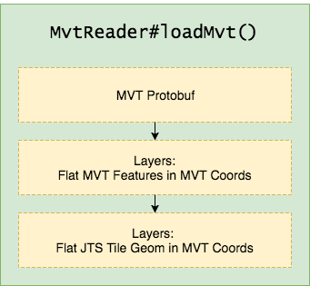
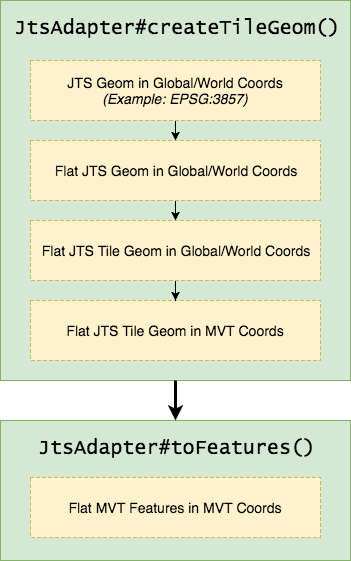

# MapBox Vector Tile - Java

[](https://travis-ci.org/wdtinc/mapbox-vector-tile-java)

Contents

- [Overview](#overview)
    - [Dependency](#dependency)
    - [Reading MVTs](#reading-mvts)
    - [Building and Writing MVTs](#building-and-writing-mvts)
    - [Buffering Polygons Beyond MVT Extent](#buffering-polygons-beyond-mvt-extent)
- [Examples](#examples)
- [Generate VectorTile class using .proto](#how-to-generate-vectortile-class-using-vector_tile.proto)
- [Issues](#issues)
- [Contributing](#contributing)
- [License](#license)

## Overview

Provides:

 * protoc generated model for Mapbox Vector Tiles v2.1.
 * Provides MVT encoding through use of the Java Topology Suite (JTS).
 * Android API level 15 compatibility (as of version 3.0.0).

See:

 * https://www.mapbox.com/vector-tiles/specification/ for overview of the MVT spec.
 * https://github.com/mapbox/vector-tile-spec/tree/master/2.1 for details on the MVT spec.
 * https://developers.google.com/protocol-buffers/ for details on protoc.
 * https://projects.eclipse.org/projects/locationtech.jts for details on JTS.

### Dependency

#### Maven

Latest version using JTS 15 with android API level 15 support:

```xml
<dependency>
    <groupId>com.wdtinc</groupId>
    <artifactId>mapbox-vector-tile</artifactId>
    <version>3.1.1</version>
</dependency>
```

JTS 14 with no android support:

```xml
<dependency>
    <groupId>com.wdtinc</groupId>
    <artifactId>mapbox-vector-tile</artifactId>
    <version>2.0.0</version>
</dependency>
```

#### Gradle

Latest version using JTS 15 with android API level 15 support:

```
compile 'com.wdtinc:mapbox-vector-tile:3.1.1'
```

JTS 14 with no android support:

```
compile 'com.wdtinc:mapbox-vector-tile:2.0.0'
```

### Reading MVTs

Per-tile geometry conversion overview:



Use MvtReader.loadMvt() to load MVT data from a path or input stream
into JTS geometry. The TagKeyValueMapConverter instance will convert
MVT feature tags to a Map with primitive values. The map will be
stored as a JTS geometry user data object within the Geometry.

The JtsMvt object wraps the JTS Geometry with MVT layer information
and structure.

```java
GeometryFactory geomFactory = new GeometryFactory();

JtsMvt jtsMvt = MvtReader.loadMvt(
        Paths.get("path/to/your.mvt"),
        geomFactory,
        new TagKeyValueMapConverter());


// Allow negative-area exterior rings with classifier
// (recommended for Mapbox compatibility)
JtsMvt jtsMvt = MvtReader.loadMvt(
        Paths.get("path/to/your.mvt"),
        geomFactory,
        new TagKeyValueMapConverter(),
        MvtReader.RING_CLASSIFIER_V1);
```

### Building and Writing MVTs

Per-layer geometry conversion overview:



#### 1) Create or Load JTS Geometry

Create or load any JTS Geometry that will be included in the MVT. The Geometries are assumed
to be in the global/world units for your target projection. Example: meters for EPSG:3857.

#### 2) Create Tiled JTS Geometry in MVT Coordinates

Create tiled JTS geometry with JtsAdapter#createTileGeom(). MVTs currently
do not support feature collections so any JTS geometry collections will be flattened
to a single level. A TileGeomResult will contain the world/global intersection
geometry from clipping as well as the actual MVT geometry that uses
tile extent coordinates. The intersection geometry can be used for hierarchical
processing, while the extent geometry is intended to be encoded as the tile geometry.
Keep in mind that MVTs use local 'screen coordinates' with inverted y-axis compared with cartesian.

```java
IGeometryFilter acceptAllGeomFilter = geometry -> true;
Envelope tileEnvelope = new Envelope(0d, 100d, 0d, 100d); // TODO: Your tile extent here
MvtLayerParams layerParams = new MvtLayerParams(); // Default extent

TileGeomResult tileGeom = JtsAdapter.createTileGeom(
        jtsGeom, // Your geometry
        tileEnvelope,
        geomFactory,
        layerParams,
        acceptAllGeomFilter);
```

JavaDoc for JtsAdapter.createTileGeom()

```java
/**
 * Create geometry clipped and then converted to MVT 'extent' coordinates. Result
 * contains both clipped geometry (intersection) and transformed geometry for encoding to MVT.
 *
 * <p>Uses the same tile and clipping coordinates. May cause rendering issues on boundaries for polygons
 * or line geometry depending on styling.</p>
 *
 * @param g original 'source' geometry
 * @param tileEnvelope world coordinate bounds for tile
 * @param geomFactory creates a geometry for the tile envelope
 * @param mvtLayerParams specifies vector tile properties
 * @param filter geometry values that fail filter after transforms are removed
 * @return tile geometry result
 * @see TileGeomResult
 */
public static TileGeomResult createTileGeom(Geometry g,
                                            Envelope tileEnvelope,
                                            GeometryFactory geomFactory,
                                            MvtLayerParams mvtLayerParams,
                                            IGeometryFilter filter)
```


#### 3) Create MVT Builder, Layers, and Features

After creating a tile's geometry in step 2, it is ready to be encoded in a MVT protobuf.

Note: Applications can perform step 2 multiple times to place geometry in separate MVT layers.

Create the VectorTile.Tile.Builder responsible for the MVT protobuf
byte array. This is the top-level object for writing the MVT:

```java
VectorTile.Tile.Builder tileBuilder = VectorTile.Tile.newBuilder();
```

Create an empty layer for the MVT using the MvtLayerBuild#newLayerBuilder() utility function:

```java
VectorTile.Tile.Layer.Builder layerBuilder = MvtLayerBuild.newLayerBuilder("myLayerName", layerParams);
```

MVT JTS Geometry from step 2 need to be converted to MVT features.

MvtLayerProps is a supporting class for building MVT layer
key/value dictionaries. A user data converter will take JTS Geometry
user data (preserved during MVT tile geometry conversion) and convert it to MVT tags:

```java
MvtLayerProps layerProps = new MvtLayerProps();
IUserDataConverter userDataConverter = new UserDataKeyValueMapConverter();
List<VectorTile.Tile.Feature> features = JtsAdapter.toFeatures(tileGeom.mvtGeoms, layerProps, userDataConverter);
```

Use MvtLayerBuild#writeProps() utility function after JtsAdapter#toFeatures() to add the key/value dictionary to the
MVT layer:

```java
MvtLayerBuild.writeProps(layerBuilder, layerProps);
```

#### 4) Write MVT

This example writes the MVT protobuf byte array to an output file.

```java
VectorTile.Tile mvt = tileBuilder.build();
try {
    Files.write(path, mvt.toByteArray());
} catch (IOException e) {
    logger.error(e.getMessage(), e);
}
```

### Buffering Polygons Beyond MVT Extent

For polygon geometry that will be styled with outlines, it is recommended that
the clipping area be larger than the tile extent area. This can be handled like
the example in MvtBuildTest#testBufferedPolygon(). Code example:

```java
// Create input geometry
final GeometryFactory geomFactory = new GeometryFactory();
final Geometry inputGeom = buildPolygon(RANDOM, 200, geomFactory);

// Build tile envelope - 1 quadrant of the world
final double tileWidth = WORLD_SIZE * .5d;
final double tileHeight = WORLD_SIZE * .5d;
final Envelope tileEnvelope = new Envelope(0d, tileWidth, 0d, tileHeight);

// Build clip envelope - (10 * 2)% buffered area of the tile envelope
final Envelope clipEnvelope = new Envelope(tileEnvelope);
final double bufferWidth = tileWidth * .1f;
final double bufferHeight = tileHeight * .1f;
clipEnvelope.expandBy(bufferWidth, bufferHeight);

// Build buffered MVT tile geometry
final TileGeomResult bufferedTileGeom = JtsAdapter.createTileGeom(
        JtsAdapter.flatFeatureList(inputGeom),
        tileEnvelope, clipEnvelope, geomFactory,
        DEFAULT_MVT_PARAMS, ACCEPT_ALL_FILTER);

// Create MVT layer
final VectorTile.Tile mvt = encodeMvt(DEFAULT_MVT_PARAMS, bufferedTileGeom);
```

## Examples

See [tests](https://github.com/wdtinc/mapbox-vector-tile-java/tree/readme_upgrade/src/test/java/com/wdtinc/mapbox_vector_tile).

## How to generate VectorTile class using vector_tile.proto

If vector_tile.proto is changed in the specification, VectorTile may need to be regenerated.

Command `protoc` version should be the same version as the POM.xml dependency.

protoc --java_out=src/main/java src/main/resources/vector_tile.proto

#### Extra .proto config

These options were added to the .proto file:

 * syntax = "proto2";
 * option java_package = "com.wdtinc.mapbox_vector_tile";
 * option java_outer_classname = "VectorTile";

## Issues

#### Reporting

Use the Github issue tracker.

#### Known Issues

 * Creating tile geometry with non-simple line strings that self-cross in many places will be 'noded' by JTS during an intersection operation. This results in ugly output.
 * Invalid or non-simple geometry may not work correctly with JTS operations when creating tile geometry.

## Contributing

See [CONTRIBUTING](CONTRIBUTING.md)
 
## License

http://www.apache.org/licenses/LICENSE-2.0.html
